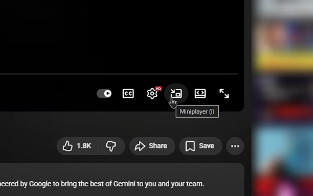

# YouTube Miniplayer Button Restorer

A browser extension that restores the missing miniplayer button to YouTube's video player controls.

**Supports Chrome and Firefox**

  
  

*[日本語README](README_ja.md)*

## Features

- Adds a miniplayer button between the settings and theater mode buttons in the video player
- Click the button or press the `i` key to launch miniplayer mode

## Installation

### Chrome

#### From Chrome Web Store (Recommended)

Install directly from the Chrome Web Store:

**[Install from Chrome Web Store](https://chromewebstore.google.com/detail/youtube-miniplayer-button/bfbihleaagnbgnoapdlabkgmenedkopf)**

#### Manual Installation (Chrome)

1. Download (or clone) this repository
2. Open `chrome://extensions/` in Chrome
3. Turn on "Developer mode" in the top right
4. Click "Load unpacked"
5. Select the downloaded folder

### Firefox

#### From Firefox Add-ons (Recommended)

Install directly from the Firefox Add-ons site:

**[Install from Firefox Add-ons](https://addons.mozilla.org/ja/firefox/addon/yt-miniplayer-button-restorer/)**

#### Manual Installation (Firefox)

1. Download (or clone) this repository
2. Open `about:debugging` in Firefox
3. Click "This Firefox" in the left sidebar
4. Click "Load Temporary Add-on"
5. Select the `manifest.json` file from the downloaded folder

*Note: Requires Firefox 109 or later*

## Usage

After installation, when you open a YouTube video, the miniplayer button will automatically appear in the player control bar (bottom control panel).

- **Click the button**: Launch miniplayer
- **Press `i` key**: Also launches via keyboard shortcut

## License

MIT License

## Bug Reports & Feature Requests

For bugs or feature requests, please submit an issue on GitHub.