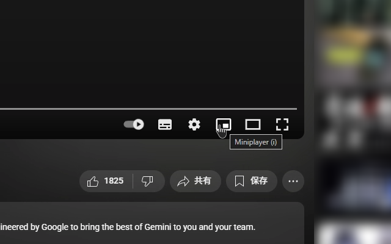

# YouTube Miniplayer Button Restorer

YouTubeの動画プレーヤーコントロールから削除されたミニプレーヤーボタンを復活させるブラウザ拡張機能です。

**Chrome・Firefoxに対応**

  
  

*[English README](README.md)*

## 機能

- 動画プレーヤーの設定ボタンとシアターモードボタンの間にミニプレーヤーボタンを追加
- ボタンをクリックするか、キーボードの`i`キーでミニプレーヤーモードを起動

## インストール方法

### Chrome

#### Chrome Web Storeから（推奨）

Chrome Web Storeから直接インストールできます：

**[Chrome Web Storeからインストール](https://chromewebstore.google.com/detail/youtube-miniplayer-button/bfbihleaagnbgnoapdlabkgmenedkopf)**

#### 手動インストール（Chrome）

1. このリポジトリをダウンロード（またはクローン）
2. Chromeで`chrome://extensions/`を開く
3. 右上の「デベロッパーモード」をオンにする
4. 「非パッケージ拡張機能を読み込む」をクリック
5. ダウンロードしたフォルダを選択

### Firefox

#### Firefox Add-onsから（推奨）

Firefox Add-onsから直接インストールできます：

**[Firefox Add-onsからインストール](https://addons.mozilla.org/ja/firefox/addon/yt-miniplayer-button-restorer/)**

#### 手動インストール（Firefox）

1. このリポジトリをダウンロード（またはクローン）
2. Firefoxで`about:debugging`を開く
3. 左サイドバーの「このFirefox」をクリック
4. 「一時的なアドオンを読み込む」をクリック
5. ダウンロードしたフォルダから`manifest.json`ファイルを選択

*注: Firefox 109以降が必要です*

## 使い方

インストール後、YouTube動画を開くと、プレーヤーコントロールバー（下部の操作パネル）にミニプレーヤーボタンが自動で表示されます。

- **ボタンをクリック**: ミニプレーヤーが起動
- **`i`キーを押す**: キーボードショートカットでも起動可能

## ライセンス

MIT License

## 問題報告・要望

不具合や機能要望がある場合は、GitHubのIssueまでお願いします。
